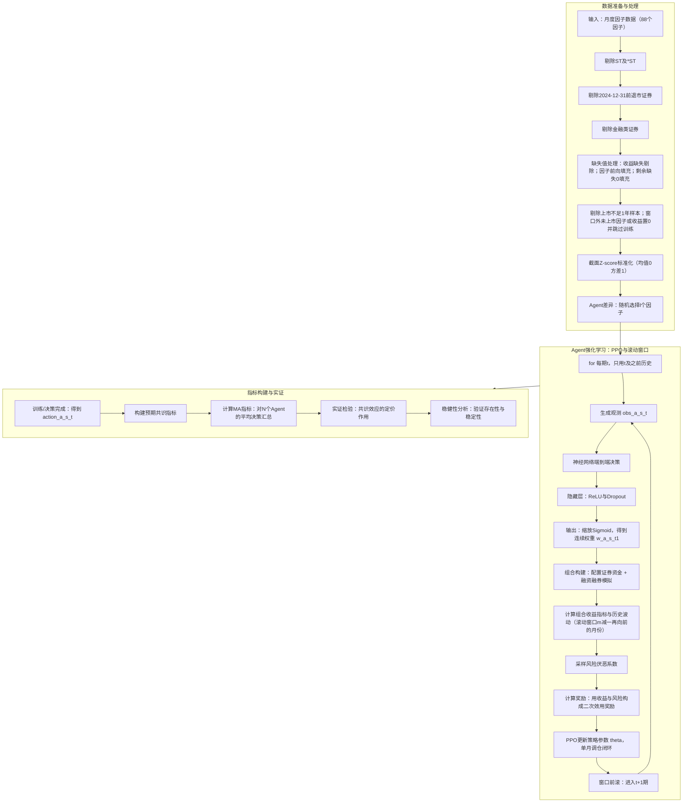

```mermaid
flowchart TD
  %% ===================== 数据准备 =====================
  subgraph D[数据准备与处理]
    A0[输入：月度因子数据（88个因子）] --> A1[剔除ST及*ST]
    A1 --> A2[剔除2024-12-31前退市证券]
    A2 --> A3[剔除金融类证券]
    A3 --> A4[缺失值处理：收益缺失剔除；因子前向填充；剩余缺失0填充]
    A4 --> A5[剔除上市不足1年样本；窗口外未上市因子或收益置0并跳过训练]
    A5 --> A6[截面Z-score标准化（均值0方差1）]
    A6 --> A7[Agent差异：随机选择l个因子]
  end

  %% ===================== Agent学习与决策循环 =====================
  subgraph RL[Agent强化学习：PPO与滚动窗口]
    B0[for 每期t，只用t及之前历史] --> B1[生成观测 obs_a_s_t]
    B1 --> B2[神经网络端到端决策]
    B2 --> B3[隐藏层：ReLU与Dropout]
    B3 --> B4[输出：缩放Sigmoid，得到连续权重 w_a_s_t1]
    B4 --> B5[组合构建：配置证券资金 + 融资融券模拟]
    B5 --> B6[计算组合收益指标与历史波动（滚动窗口m减一再向前的月份）]
    B6 --> B7[采样风险厌恶系数]
    B7 --> B8[计算奖励：用收益与风险构成二次效用奖励]
    B8 --> B9[PPO更新策略参数 theta，单月调仓闭环]
    B9 --> B10[窗口前滚：进入t+1期]
    B10 --> B1
  end

  %% ===================== 指标与检验 =====================
  subgraph M[指标构建与实证]
    C0[训练/决策完成：得到 action_a_s_t] --> C1[构建预期共识指标]
    C1 --> C2[计算MA指标：对N个Agent的平均决策汇总]
    C2 --> C3[实证检验：共识效应的定价作用]
    C3 --> C4[稳健性分析：验证存在性与稳定性]
  end

  %% ===================== 连接主流程 =====================
  A7 --> B0
  RL --> M
```